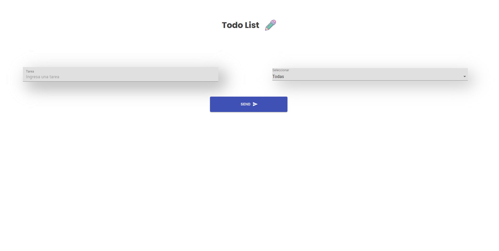

<div align="center" >


 <div>

# To Do List 

### Este sitio web fue desarrollado para ayudarte a organizar tus proyectos. Es muy fácil de usar y te permite revisar el estado de tus actividades en la compu o desde el celular. 
***
<br>

### Comenza a usarlo haciendo click [aquí](https://mandisa-94.github.io/todo-list/)

</br>

***
<br>

## Conocé la vista de escritorio 


</br>

***
<br>

## Instalación ⚙
#### Si querés clonar el repositorio seguí estos pasos:


 Entrar al [Repo](https://github.com/Mandisa-94/todo-list)

 Hacer click en Fork

 Darle click al boton de Code

 Copiar la url

 Desde tu terminal local posicionate en la carpeta donde lo vas a clonar

 Escribir el siguiente comando:
```
git clone <url>
```
 Entrar a la carpeta del proyecto y abrirlo en tu IDE y listo, ya vas a contar con el proyecto en tu pc.

</br>

***
<br>

## Diseño 🎨

#### Para el diseño de la interfaz utilice el Framework [Material UI](https://material-ui.com/).

</br>

***
<br>

## Dependencias 🛠

#### Las tareas se guardan en la base de datos de  [Firebase](https://firebase.google.com/).

</br>

***
<br>

## Contacto 📱

[Gabriela Duran](https://www.linkedin.com/in/gabriela-duran94/)

***
<br>

## Agradecimientos 💕

 Principalmente a mi profe [Jonh](https://github.com/Jonhks), a [Leydy](https://github.com/leydyk93) y a las chicas de la sexta generación de Frontend online de [Ada](https://adaitw.org/) 🧚🏻‍♀️ por su apoyo y compañerismo.
